---

**Orijinal:** [Introduction to Linear Algebra for Applied Machine Learning with Python](https://pabloinsente.github.io/intro-linear-algebra)  
**Yazar:** Pablo Caceres  
**Tarih:** 26 Mayıs 2020  
**Çeviri:** Türkçe

---

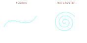
*Şekil 1: Fonksiyonlar - Sol panel geçerli bir fonksiyonu (her girdi tek bir çıktıya eşlenir), sağ panel geçersiz bir fonksiyonu gösterir (her girdi birden fazla çıktıya eşlenir)*

---

## Giriş

Doğrusal cebir, makine öğrenmesi için unun fırıncılık için olduğu gibidir: **her makine öğrenmesi modeli doğrusal cebire dayanır, tıpkı her pastanın una dayanması gibi**. Elbette bu tek malzeme değildir. Makine öğrenmesi modelleri vektör hesabı, olasılık ve optimizasyona ihtiyaç duyar, tıpkı pastaların şeker, yumurta ve tereyağına ihtiyaç duyması gibi. Uygulamalı makine öğrenmesi, tıpkı fırıncılık gibi, esasen bu matematiksel malzemeleri yararlı (lezzetli?) modeller oluşturmak için akıllıca birleştirmekle ilgilidir.

Bu doküman **uygulamalı makine öğrenmesi için giriş seviyesi doğrusal cebir notlarını** içerir. Kapsamlı bir inceleme yerine referans olarak tasarlanmıştır. Matris çarpımında kafanız karışırsa, $L_2$ normunun ne olduğunu hatırlayamazsanız veya doğrusal bağımsızlık koşullarını unutursanız, bu kaynak hızlı bir referans olarak kullanılabilir. Ayrıca, doğrusal cebirin derinlemesine bir anlayışına ihtiyaç duymayan, ancak makine öğrenmesi hakkında okumak veya hazır makine öğrenmesi çözümlerini kullanmak için temelleri öğrenmek isteyen kişiler için de iyi bir giriş niteliğindedir. Ayrıca, bir süre önce doğrusal cebir öğrenmiş ve tazelemeye ihtiyaç duyan kişiler için de iyi bir kaynaktır.

Bu notlar, geçmişte okuduğum, izlediğim ve aldığım bir dizi (çoğunlukla) ücretsiz ders kitabı, video ders ve sınıflara dayanmaktadır. Her konu için daha derin bir anlayış elde etmek veya egzersizler bulmak isterseniz, bu kaynaklara doğrudan başvurmanızı öneririm.

## Ücretsiz Kaynaklar

- **Mathematics for Machine Learning** - Deisenroth, Faisal ve Ong. 1. Baskı. [Kitap bağlantısı](https://mml-book.github.io/)
- **Introduction to Applied Linear Algebra** - Boyd ve Vandenberghe. 1. Baskı. [Kitap bağlantısı](http://vmls-book.stanford.edu/)
- **Linear Algebra Ch. in Deep Learning** - Goodfellow, Bengio ve Courville. 1. Baskı. [Bölüm bağlantısı](https://www.deeplearningbook.org/contents/linear_algebra.html)
- **Linear Algebra Ch. in Dive into Deep Learning** - Zhang, Lipton, Li ve Smola. [Bölüm bağlantısı](https://d2l.ai/chapter_preliminaries/linear-algebra.html)
- **Prof. Pavel Grinfeld'in Doğrusal Cebir Dersleri** - Lemma. [Video bağlantısı](https://www.lem.ma/books/AIApowDnjlDDQrp-uOZVow/landing)
- **Prof. Gilbert Strang'in Doğrusal Cebir Dersleri** - MIT. [Video bağlantısı](https://ocw.mit.edu/courses/mathematics/18-06-linear-algebra-spring-2010/video-lectures/)
- **Salman Khan'ın Doğrusal Cebir Dersleri** - Khan Academy. [Video bağlantısı](https://www.khanacademy.org/math/linear-algebra)
- **3blue1brown'un Doğrusal Cebir Serisi** - YouTube. [Video bağlantısı](https://www.youtube.com/playlist?list=PLZHQObOWTQDPD3MizzM2xVFitgF8hE_ab)

## Ücretli Kaynaklar

- **Introduction to Linear Algebra** - Gilbert Strang. 5. Baskı.
- **No Bullshit Guide to Linear Algebra** - Ivan Savov. 2. Baskı.

---

## İçindekiler

- [Ön Hazırlık Kavramları](#ön-hazırlık-kavramları)
  - [Kümeler](#kümeler)
  - [Fonksiyonlar](#fonksiyonlar)
- [Vektörler](#vektörler)
  - [Vektör Türleri](#vektör-türleri)
  - [Temel Vektör İşlemleri](#temel-vektör-işlemleri)
  - [Vektör Uzayı ve Alt Uzaylar](#vektör-uzayı-ve-alt-uzaylar)
  - [Vektör Normları](#vektör-normları)
- [Matrisler](#matrisler)
  - [Temel Matris İşlemleri](#temel-matris-işlemleri)
  - [Özel Matrisler](#özel-matrisler)
- [Doğrusal Dönüşümler](#doğrusal-dönüşümler)
- [Matris Ayrıştırmaları](#matris-ayrıştırmaları)

---

## Ön Hazırlık Kavramları

Doğrusal cebir çalışmasına yaklaşmadan önce birkaç temel kavramı anlamanın önemini fark ettim. Eğer benim gibiyseniz, lise ötesinde resmi matematik eğitiminiz olmayabilir. Eğer öyleyse, doğrusal cebir içeriğine geçmeden önce bu kavramları anlamak için zaman harcamanızı öneririm.

### Kümeler

Kümeler, matematiğin en temel kavramlarından biridir. O kadar temeldirler ki başka bir şeyle tanımlanmazlar. Aksine, diğer matematik dalları kümeler cinsinden tanımlanır, doğrusal cebir de dahil. Basitçe söylemek gerekirse, **kümeler iyi tanımlanmış nesne koleksiyonlarıdır**. Bu tür nesnelere kümenin **elemanları veya üyeleri** denir. 

Bir geminin mürettebatı, bir deve kervanı ve LA Lakers kadrosu, hepsi küme örnekleridir. Geminin kaptanı, kervandaki ilk deve ve LeBron James, karşılık gelen kümelerinin "üyeleri" veya "elemanları"na örnektir. Doğrusal cebir bağlamında, bir çizginin noktaların bir kümesi olduğunu ve düzlemdeki tüm çizgilerin kümesinin bir küme kümesi olduğunu söyleriz. Benzer şekilde, *vektörlerin* noktaların kümeleri olduğunu ve *matrislerin* vektörlerin kümeleri olduğunu söyleyebiliriz.

#### Üyelik ve Kapsama

Kümeleri **üyelik** kavramını kullanarak oluştururuz. $a$'nın $\textit{A}$'ya ait olduğunu (veya $\textit{A}$'nın elemanı veya üyesi olduğunu) Yunan epsilon harfiyle şöyle gösteririz:

$$a \in \textit{A}$$

**Kapsama** da önemli bir kavramdır ve bize *alt kümeler* oluşturmamıza izin verir. $\textit{A}$ ve $\textit{B}$ kümelerini ele alalım. $\textit{A}$'nın her elemanı aynı zamanda $\textit{B}$'nin elemanı olduğunda, $\textit{A}$'nın $\textit{B}$'nin bir *alt kümesi* olduğunu veya $\textit{B}$'nin $\textit{A}$'yı *kapsadığını* söyleriz:

$$\textit{A} \subset \textit{B}$$

veya

$$\textit{B} \supset \textit{A}$$

### Fonksiyonlar

$\textit{X}$ ve $\textit{Y}$ kümeleri çiftini ele alalım. $\textit{X}$'ten $\textit{Y}$'ye bir **fonksiyon**un şu özelliklere sahip bir ilişki olduğunu söyleriz:

- $dom \textit{ f} = \textit{X}$ ve
- $\textit{X}$'teki her $\textit{x}$ için $\textit{Y}$'de benzersiz bir $\textit{y}$ elemanı vardır

Daha gayri resmi olarak, bir fonksiyonun $\textit{x}$'i $\textit{y}$'ye "dönüştürdüğünü" veya "eşleştirdiğini" veya "gönderdiğini" söyleriz. Tipik olarak, $\textit{X}$'ten $\textit{Y}$'ye bir ilişki, fonksiyon, dönüşüm veya eşleme şöyle gösterilir:

$$\textit{f}: \textit{X} \rightarrow \textit{Y}$$

veya

$$\textit{f}(\textit{x}) = \textit{y}$$

**Makine öğrenmesinin nihai amacı, verilerden fonksiyonlar öğrenmektir**, yani bir fonksiyonun *tanım kümesinden* *değer kümesine* dönüşümler veya eşlemeler. Bu basite indirgemecilik gibi gelebilir, ancak doğrudur. Tanım kümesi $\textit{X}$ genellikle *değişkenlerin* veya *özelliklerin* bir vektörü (veya kümesi) olup, *hedef* değerlerin bir vektörüne eşlenir.

---

## Vektörler

Doğrusal cebir, vektörlerin çalışmasıdır. En genel düzeyde, vektörler **sıralı sonlu sayı listeleridir**. Vektörler, makine öğrenmesindeki en temel matematiksel nesnedir. Onları **varlıkların niteliklerini temsil etmek** için kullanırız: yaş, cinsiyet, test puanları vb. Vektörleri $\bf{v}$ gibi kalın küçük harflerle veya $\vec{v}$ gibi ok işaretiyle gösteririz.

Vektörler, **bir arada toplanabilen** ve/veya **bir sayı ile çarpıldığında aynı türden başka bir nesne elde edilen** matematiksel nesnelerin bir türüdür. Örneğin, $\bf{x} = \text{yaş}$ vektörüne ve $\bf{y} = \text{ağırlık}$ ikinci vektörüne sahipsek, onları bir arada toplayabilir ve üçüncü bir vektör $\bf{z} = x + y$ elde edebiliriz. Ayrıca $2 \times \bf{x}$'i çarparak $2\bf{x}$ elde edebiliriz, yine bir vektör. *Aynı türden* derken, dönen nesnenin hala bir *vektör* olduğunu kastediyoruz.

### Vektör Türleri

Vektörler üç türde gelir: (1) **geometrik vektörler**, (2) **polinomlar**, (3) ve **$\mathbb{R^n}$ uzayının elemanları**.

#### Geometrik Vektörler

**Geometrik vektörler yönlendirilmiş segmentlerdir**. Muhtemelen lise fizik ve geometrisinde öğrendiğiniz vektör türü bunlardır. Birçok doğrusal cebir kavramı vektörlerin geometrik bakış açısından gelir: uzay, düzlem, mesafe vb.

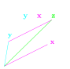
*Şekil 2: Geometrik vektörler - Yönlendirilmiş segmentler*

#### Polinomlar

**Polinom, $f(x) = x^2 + y + 1$ gibi bir ifadedir**. Birden fazla "terim" ekleyen bir ifadedir (nomials). Polinomlar vektördür çünkü vektör tanımını karşılarlar: bir arada toplandıklarında başka bir polinom elde edilir ve bir sayı ile çarpıldıklarında başka bir polinom elde edilir.

$$\text{fonksiyon toplama geçerlidir} \\
f(x) + g(x)$$

$$\text{ve}$$

$$\text{skalerle çarpma geçerlidir} \\
5 \times f(x)$$

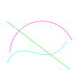
*Şekil 3: Polinomlar - Vektör olarak polinomlar*

#### R^n Elemanları

**$\mathbb{R}^n$ elemanları gerçek sayı kümeleridir**. Bu temsil türü, uygulamalı makine öğrenmesi için tartışmasız en önemli olanıdır. Bilgisayarlarda makine öğrenmesi modelleri oluşturmak için verilerin yaygın olarak temsil edilme şekli budur. Örneğin, $\mathbb{R}^3$'te bir vektör şu şekildedir:

$$\bf{x}=
\begin{bmatrix}
x_1 \\
x_2 \\
x_3
\end{bmatrix}
\in \mathbb{R}^3$$

Bu, üç boyut içerdiğini gösterir.

$$\text{toplama geçerlidir} \\
\begin{bmatrix}
1 \\
2 \\
3
\end{bmatrix} +
\begin{bmatrix}
1 \\
2 \\
3
\end{bmatrix}=
\begin{bmatrix}
2 \\
4 \\
6
\end{bmatrix}$$

$$\text{ve}$$

$$\text{skalerle çarpma geçerlidir} \\
5 \times
\begin{bmatrix}
1 \\
2 \\
3
\end{bmatrix} = 
\begin{bmatrix}
5 \\
10 \\
15
\end{bmatrix}$$

**NumPy'de**, vektörler n-boyutlu diziler olarak temsil edilir. $\mathbb{R}^3$'te bir vektör oluşturmak için:

```python
import numpy as np

x = np.array([[1],
              [2],
              [3]])

# Vektör şeklini inceleyelim
x.shape  # (3 boyut, her biri 1 eleman)
# (3, 1)

print(f'3 boyutlu bir vektör:\n{x}')
# 3 boyutlu bir vektör:
# [[1]
#  [2]
#  [3]]
```

### Sıfır Vektörü, Birim Vektör ve Seyrek Vektör

Uygulamalı doğrusal cebirde sıkça bahsedilecek hatırlamaya değer birkaç "özel" vektör vardır:

**Sıfır vektörleri**, yalnızca sıfırlardan oluşan vektörlerdir. Boyuttan bağımsız olarak bu vektörün sadece $0$ olarak gösterilmesi yaygındır. Örneğin:

$$\bf{0} = 
\begin{bmatrix}
0\\
0\\
0
\end{bmatrix}$$

**Birim vektörler**, tek bir elemanı bire eşit ve geri kalanı sıfır olan vektörlerdir. Birim vektörler, normlar gibi uygulamaları anlamak için önemlidir. Örneğin, $\bf{x_1}$, $\bf{x_2}$ ve $\bf{x_3}$ birim vektörlerdir:

$$\bf{x_1} = 
\begin{bmatrix}
1\\
0\\
0
\end{bmatrix},
\bf{x_2} = 
\begin{bmatrix}
0\\
1\\
0
\end{bmatrix},
\bf{x_3} = 
\begin{bmatrix}
0\\
0\\
1
\end{bmatrix}$$

**Seyrek vektörler**, çoğu elemanı sıfıra eşit olan vektörlerdir. Bir vektör $\bf{x}$'in sıfır olmayan eleman sayısını $nnz(x)$ olarak gösteririz. En seyrek olası vektör sıfır vektörüdür. Seyrek vektörler makine öğrenmesi uygulamalarında yaygındır ve genellikle onlarla etkili bir şekilde başa çıkmak için bir tür yöntem gerektirirler.

### Vektör Boyutları ve Koordinat Sistemi

Vektörler herhangi bir sayıda boyuta sahip olabilir. En yaygın olanları 2 boyutlu kartezyen düzlem ve 3 boyutlu uzaydır. 2 ve 3 boyutlu vektörler sıklıkla geometrik vektörler olarak görselleştirebildiğimiz için pedagojik amaçlarla kullanılır. Bununla birlikte, makine öğrenmesindeki çoğu problem daha fazla boyut içerir, bazen yüzlerce veya binlerce boyut.

$n$ boyutlu keyfi bir $\bf{x}$ vektörünün gösterimi şöyledir:

$$\bf{x} = 
\begin{bmatrix}
x_1 \\ x_2 \\ \vdots \\ x_n
\end{bmatrix}
\in \mathbb{R}^n$$

Vektör boyutları **koordinat sistemlerine veya dik eksenlere** eşlenir. Koordinat sistemlerinin orijini $(0,0,0)$'dadır, bu nedenle bir vektör tanımladığımızda:

$$\bf{x} = \begin{bmatrix} 3 \\ 2 \\ 1 \end{bmatrix} \in \mathbb{R}^3$$

şunu söylüyoruz: orijinden başlayarak, 1. dik eksende 3 birim, 2. dik eksende 2 birim ve 3. dik eksende 1 birim hareket edin. Daha sonra, dik eksenler kümesine sahip olduğumuzda bir vektör uzayının temelini elde edeceğimizi göreceğiz.

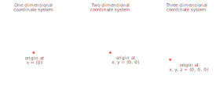
*Şekil 4: Koordinat sistemleri - 3 boyutlu kartezyen koordinat sistemi*

### Temel Vektör İşlemleri

#### Vektör-Vektör Toplama

Vektör-vektör toplamayı tanımlamadan vektörleri tanımlamak için kullandık. Vektör-vektör toplama, eleman bazında bir işlemdir, yalnızca aynı boyuttaki vektörler için tanımlanır (yani, eleman sayısı). Aynı boyuttaki iki vektör için:

$$\bf{x} + \bf{y} = 
\begin{bmatrix}
x_1\\
\vdots\\
x_n
\end{bmatrix}+
\begin{bmatrix}
y_1\\
\vdots\\
y_n
\end{bmatrix} =
\begin{bmatrix}
x_1 + y_1\\
\vdots\\
x_n + y_n
\end{bmatrix}$$

Örneğin:

$$\bf{x} + \bf{y} = 
\begin{bmatrix}
1\\
2\\
3
\end{bmatrix}+
\begin{bmatrix}
1\\
2\\
3
\end{bmatrix} =
\begin{bmatrix}
1 + 1\\
2 + 2\\
3 + 3
\end{bmatrix} =
\begin{bmatrix}
2\\
4\\
6
\end{bmatrix}$$

Vektör toplamanın bir dizi **temel özelliği** vardır:

1. **Değişmelilik**: $x + y = y + x$
2. **Birleşebilirlik**: $(x + y) + z = x + (y + z)$
3. **Sıfır vektörü eklemek etkisizdir**: $x + 0 = 0 + x = x$
4. **Bir vektörü kendisinden çıkarmak sıfır vektörünü döndürür**: $x - x = 0$

**NumPy'de**, aynı boyuttaki iki vektörü `+` operatörü veya `add` yöntemiyle ekleriz:

```python
x = y = np.array([[1],
                  [2],
                  [3]])

x + y
# array([[2],
#        [4],
#        [6]])

np.add(x, y)
# array([[2],
#        [4],
#        [6]])
```

#### Vektör-Skaler Çarpma

Vektör-skaler çarpma, eleman bazında bir işlemdir. Şöyle tanımlanır:

$$\alpha \bf{x} = 
\begin{bmatrix}
\alpha \bf{x_1}\\
\vdots \\
\alpha \bf{x_n}
\end{bmatrix}$$

$\alpha = 2$ ve $\bf{x} = \begin{bmatrix} 1 \ 2 \ 3 \end{bmatrix}$ olarak ele alalım:

$$\alpha \bf{x} = 
\begin{bmatrix}
2 \times 1\\
2 \times 2\\
2 \times 3
\end{bmatrix} = 
\begin{bmatrix}
2\\
4\\
6
\end{bmatrix}$$

Vektör-skaler çarpma şu önemli özellikleri sağlar:

1. **Birleşebilirlik**: $(\alpha \beta) \bf{x} = \alpha (\beta \bf{x})$
2. **Soldan dağılma özelliği**: $(\alpha + \beta) \bf{x} = \alpha \bf{x} + \beta \bf{x}$
3. **Sağdan dağılma özelliği**: $\bf{x} (\alpha + \beta) = \bf{x} \alpha + \bf{x} \beta$
4. **Vektör toplama için sağdan dağılma özelliği**: $\alpha (\bf{x} + \bf{y}) = \alpha \bf{x} + \alpha \bf{y}$

**NumPy'de**, `*` operatörü ile skaler-vektör çarpımı hesaplarız:

```python
alpha = 2
x = np.array([[1],
             [2],
             [3]])

alpha * x
# array([[2],
#        [4],
#        [6]])
```

#### Vektörlerin Doğrusal Kombinasyonları

Doğrusal cebirde vektörlerle yalnızca iki yasal işlem vardır: **toplama** ve **sayılarla çarpma**. Bunları birleştirdiğimizde, bir **doğrusal kombinasyon** elde ederiz.

$$\alpha \bf{x} + \beta \bf{y} = 
\alpha
\begin{bmatrix}
x_1 \\ 
x_2
\end{bmatrix}+
\beta
\begin{bmatrix}
y_1 \\ 
y_2
\end{bmatrix}=
\begin{bmatrix}
\alpha x_1 + \alpha x_2\\ 
\beta y_1 + \beta y_2
\end{bmatrix}$$

$\alpha = 2$, $\beta = 3$, $\bf{x}=\begin{bmatrix}2 \ 3\end{bmatrix}$ ve $\begin{bmatrix}4 \ 5\end{bmatrix}$ olarak ele alalım:

$$\alpha \bf{x} + \beta \bf{y} = 
2
\begin{bmatrix}
2 \\ 
3
\end{bmatrix}+
3
\begin{bmatrix}
4 \\ 
5
\end{bmatrix}=
\begin{bmatrix}
2 \times 2 + 2 \times 4\\ 
2 \times 3 + 3 \times 5
\end{bmatrix}=
\begin{bmatrix}
10 \\
21
\end{bmatrix}$$

Doğrusal kombinasyonlar, doğrusal cebirdeki en temel işlemdir. Doğrusal cebirdeki her şey doğrusal kombinasyonlardan kaynaklanır. Örneğin, doğrusal regresyon vektörlerin bir doğrusal kombinasyonudur.

**NumPy'de**, doğrusal kombinasyonları şöyle yaparız:

```python
a, b = 2, 3
x, y = np.array([[2],[3]]), np.array([[4], [5]])

a*x + b*y
# array([[16],
#        [21]])
```

#### Vektör-Vektör Çarpma: Nokta Çarpımı

Vektör toplama ve skalerlerle çarpma konusunu ele aldık. Şimdi vektör-vektör çarpmayı tanımlayacağım, yaygın olarak **nokta çarpımı** veya **iç çarpım** olarak bilinir. $\bf{x}$ ve $\bf{y}$'nin nokta çarpımı şöyle tanımlanır:

$$\bf{x} \cdot \bf{y} :=
\begin{bmatrix}
x_1 \\
x_2
\end{bmatrix}^T
\begin{bmatrix}
y_1 \\
y_2
\end{bmatrix} =
\begin{bmatrix}
x_1 & x_2
\end{bmatrix}
\begin{bmatrix}
y_1 \\
y_2
\end{bmatrix} =
x_1 \times y_1 + x_2 \times y_2$$

Burada $T$ üst simgesi vektörün devriğini (transpozunu) belirtir. Bir vektörü devrik hale getirmek, sütun vektörünü saat yönünün tersine "çevirmek" anlamına gelir. Örneğin:

$$\bf{x} \cdot \bf{y} =
\begin{bmatrix}
-2 \\
2
\end{bmatrix}
\begin{bmatrix}
4 \\
-3
\end{bmatrix} =
\begin{bmatrix}
-2 & 2
\end{bmatrix}
\begin{bmatrix}
4 \\
-3
\end{bmatrix} =
-2 \times 4 + 2 \times -3 = (-8) + (-6) = -14$$

Nokta çarpımları makine öğrenmesinde o kadar önemlidir ki, bir süre sonra uygulayıcılar için ikinci doğaya dönüşürler.

**NumPy'de** (satır=2, sütun=1) boyutlarına sahip iki vektörü çarpmak için, ilk vektörü `@` operatörünü kullanarak devrik hale getirmemiz gerekir:

```python
x, y = np.array([[-2],[2]]), np.array([[4],[-3]])

x.T @ y
# array([[-14]])
```

### Vektör Uzayı, Kapsam ve Alt Uzay

#### Vektör Uzayı

En genel formunda, bir **vektör uzayı** (veya **doğrusal uzay**), $\mathbb{R}^n$'deki vektörler için tanımlanan kurallara uyan nesnelerin bir koleksiyonudur. Vektörleri tanımlarken bahsettiğimiz kurallar bunlardır: bir arada toplanabilirler ve skalerlerle çarpılabilirler ve aynı türden vektörler döndürürler. Daha samimi bir ifadeyle, bir vektör uzayı uygun vektörlerin kümesi ve vektör kümesinin tüm olası doğrusal kombinasyonlarıdır.

#### Vektör Kapsamı

$\bf{x}$ ve $\bf{y}$ vektörleri ile $\alpha$ ve $\beta$ skalerlerini ele alalım. $\alpha \bf{x} + \beta \bf{y}$'nin *tüm* olası doğrusal kombinasyonlarını alırsak, bu vektörlerin **kapsamını** elde ederiz. Bunu geometrik vektörler hakkında düşünürken kavramak daha kolaydır. Eğer vektörlerimiz $\bf{x}$ ve $\bf{y}$ 2 boyutlu uzayda **farklı yönlere** işaret ediyorsa, $span(x,y)$'nin **tüm 2 boyutlu düzlem** olduğunu elde ederiz. Sınırsız sayıda iki tür çubuk olduğunu hayal edin: biri dikey, biri yatay. Şimdi, dikey ve yatay çubukların gerekli sayısını birleştirerek 2 boyutlu uzaydaki herhangi bir noktaya ulaşabilirsiniz.

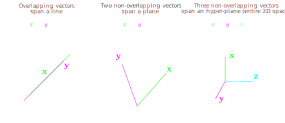
*Şekil 5: Vektör kapsamı - Sol panel: Bir çizgiyi kapsayan vektörler; Orta panel: Tüm 2D düzlemi kapsayan vektörler; Sağ panel: 3D hiper-düzlemi kapsayan vektörler*

Vektörler aynı yöne işaret ederse ne olur? Şimdi, onları birleştirirseniz, yalnızca **bir çizgiyi kapsayabilirsiniz**. "Çoklu doğrusallık" terimini duyduysanız, bu sorunla yakından ilgilidir: iki değişken "doğrusal" olduğunda, aynı yöne işaret ederler, dolayısıyla yedek bilgi sağlarlar, bu nedenle bilgi kaybı olmadan birini bırakabilirsiniz.

#### Vektör Alt Uzayları

Bir **vektör alt uzayı (veya doğrusal alt uzay), daha büyük bir vektör uzayı içinde yer alan bir vektör uzayıdır**. Bir alt uzay $S$ için, bir vektörün geçerli bir alt uzay olması için **üç koşulu** karşılaması gerekir:

1. Sıfır vektörünü içerir, $\bf{0} \in S$
2. Çarpma altında kapalılık, $\forall \alpha \in \mathbb{R} \rightarrow  \alpha \times s_i \in S$
3. Toplama altında kapalılık, $\forall s_i \in S \rightarrow  s_1 + s_2 \in S$

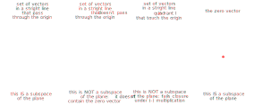
*Şekil 6: Vektör alt uzayları*

Sezgisel olarak, kapalılığı bir uzaydan diğerine "atlamanın" imkansız olduğu olarak düşünebilirsiniz. 2 boyutlu uzayda düz duran bir vektör çifti, ne toplama ne de çarpma yoluyla 3 boyutlu uzaya "atlayamaz".

### Doğrusal Bağımlılık ve Bağımsızlık

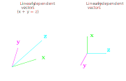
*Şekil 7: Doğrusal bağımlılık ve bağımsızlık - Sol panel: Doğrusal bağımlı vektörler; Sağ panel: Doğrusal bağımsız vektörler*

Sol panel **doğrusal bağımlı** vektörlerin bir üçlüsünü gösterirken, sağ panel **doğrusal bağımsız** vektörlerin bir üçlüsünü gösterir.

Bir vektör kümesi, kümedeki diğer vektörlerin doğrusal kombinasyonu olarak en az bir vektör elde edilebiliyorsa **doğrusal bağımlıdır**. Sol panelde görebileceğiniz gibi, $x$ ve $y$ vektörlerini birleştirerek $z$'yi elde edebiliriz.

Bir vektör kümesi, kümedeki diğer vektörlerin doğrusal kombinasyonu olarak hiçbir vektör elde edilemiyorsa **doğrusal bağımsızdır**. Sağ panelde görebileceğiniz gibi, $x$ ve $y$ vektörlerini birleştirerek $z$'yi elde etmenin bir yolu yoktur.

Şu ana kadar hatırlanması gereken önemli noktalar şunlardır: doğrusal bağımlı vektörler **yedek bilgi** içerirken, doğrusal bağımsız vektörler içermez.

### Vektör Boş Uzayı

Şimdi alt uzayların ve doğrusal bağımlı vektörlerin ne olduğunu bildiğimize göre, **boş uzay** fikrini tanıtabiliriz. Sezgisel olarak, bir vektör kümesinin boş uzayı, sıfır vektörüne "eşlendikleri" **tüm doğrusal kombinasyonlardır**.

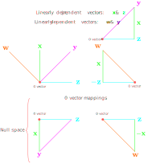
*Şekil 8: Vektör boş uzayı*

Bu dört vektörle, koordinat sisteminin kökenine, yani sıfır vektörüne $(0,0)$ "eşlenecek" şu iki kombinasyonu oluşturabiliriz:

$$\begin{matrix}
z - y + x = 0 \\
z - x + w = 0
\end{matrix}$$

### Vektör Normları

Vektörleri ölçmek, makine öğrenmesi uygulamalarında önemli bir işlemdir. Sezgisel olarak, bir vektörün **normunu** veya **uzunluğunu**, "kökeni" ile "sonu" arasındaki mesafe olarak düşünebiliriz.

Normlar vektörleri negatif olmayan değerlere "eşler". Bu anlamda bir vektör $\bf{x}$'e uzunluk $\lVert \bf{x} \rVert \in \mathbb{R^n}$ atayan fonksiyonlardır. Geçerli bir norm olması için şu özellikleri karşılaması gerekir:

1. **Mutlak homojenlik**: $\forall \alpha \in \mathbb{R},  \lVert \alpha \bf{x} \rVert = \vert \alpha \Vert \lVert \bf{x} \rVert$
2. **Üçgen eşitsizliği**: $\lVert \bf{x} + \bf{y} \rVert \le \lVert \bf{x} \rVert + \lVert \bf{y} \rVert $
3. **Pozitif tanımlı**: $\lVert \bf{x} \rVert \ge 0$ ve $\lVert \bf{x} \rVert = 0 \Longleftrightarrow \bf{x}= 0$

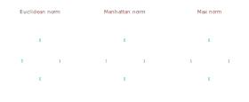
*Şekil 9: Vektör normları - L2 normu (Öklid mesafesi)*

#### Öklid Normu: $L_2$

Öklid normu, makine öğrenmesindeki en popüler normlardan biridir. O kadar yaygın kullanılır ki bazen bir vektörün "normu" olarak anılır. Şöyle tanımlanır:

$$\lVert \bf{x} \rVert_2 := \sqrt{\sum_{i=1}^n x_i^2} = \sqrt{x^Tx}$$

**İki boyutta** $L_2$ normu şöyledir:

$$\lVert \bf{x} \rVert_2 \in \mathbb{R}^2 = \sqrt {x_1^2  \cdot x_2^2 }$$

Bu, kenarları $x_1^2$ ve $x_2^2$ olan bir üçgenin hipotenüsü formülüne eşdeğerdir.

**NumPy'de**, $L_2$ normunu şöyle hesaplarız:

```python
x = np.array([[3],[4]])
np.linalg.norm(x, 2)
# 5.0
```

#### Manhattan Normu: $L_1$

Manhattan veya $L_1$ normu, Manhattan, NYC'de hareket ederken mesafe ölçmeye benzer. Manhattan ızgara şeklinde olduğundan, herhangi iki nokta arasındaki mesafe dikey ve yatay çizgiler boyunca hareket ederek ölçülür (Öklid normundaki gibi çaprazlar yerine). Şöyle tanımlanır:

$$\lVert \bf{x} \rVert_1 := \sum_{i=1}^n \vert x_i \vert$$

Burada $\vert x_i \vert$ mutlak değerdir. $L_1$ normu, tam olarak sıfır olan elemanlar ile sıfır olmayan ancak küçük olan elemanlar arasında ayrım yaparken tercih edilir.

**NumPy'de** $L_1$ normunu şöyle hesaplarız:

```python
x = np.array([[3],[-4]])
np.linalg.norm(x, 1)
# 7.0
```

#### Maks Normu: $L_\infty$

Maks normu veya sonsuzluk normu, vektördeki en büyük elemanın mutlak değeridir. Şöyle tanımlanır:

$$\lVert \bf{x} \rVert_\infty := max_i \vert x_i \vert$$

Burada $\vert x_i \vert$ mutlak değerdir. Örneğin, $\bf{x} = \begin{bmatrix} 1 & 2 & 3 \end{bmatrix}$ elemanlarına sahip bir vektör için, $\lVert \bf{x} \rVert_\infty = 3$'tür.

**NumPy'de** $L_\infty$ normunu şöyle hesaplarız:

```python
x = np.array([[3],[-4]])
np.linalg.norm(x, np.inf)
# 4.0
```

### Vektör Açıları ve Ortogonallik

Açı ve ortogonallik kavramları da geometrik vektörlerle ilgilidir. İç çarpımların uzunluk ve mesafe tanımına izin verdiğini gördük. Aynı şekilde, iç çarpımlar **açılar** ve **ortogonallik** tanımlamak için kullanılır.

Makine öğrenmesinde, bir vektör çifti arasındaki **açı**, bir vektör **benzerliğinin ölçüsü** olarak kullanılır. Açıları anlamak için önce **Cauchy–Schwarz eşitsizliğine** bakalım. Sıfır olmayan $\bf{x}$ ve $\bf{y}$ vektör çiftini $\in \mathbb{R}^n$ olarak ele alalım. Cauchy–Schwarz eşitsizliği şunu belirtir:

$$\vert \langle x, y \rangle \vert \leq \Vert x \Vert \Vert y \Vert$$

Sözcüklerle: *bir vektör çiftinin iç çarpımının mutlak değeri, uzunluklarının çarpımından küçük veya ona eşittir*. İfade edilen her iki tarafın da *eşit* olduğu tek durum, vektörler eşdoğru olduğundadır.

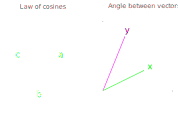
*Şekil 10: Kosinüs kuralı ve vektörler arası açı*

**Ortogonallik**, çoğu zaman "bağımsızlık" ile birbirinin yerine kullanılır, ancak matematiksel olarak farklı kavramlardır. Ortogonallik, diklik kavramının herhangi bir boyuttaki vektörlere genelleştirilmesi olarak görülebilir.

$\bf{x}$ ve $\bf{y}$ vektör çiftinin **ortogonal** olduğunu söyleriz eğer iç çarpımları sıfırsa, $\langle x,y \rangle = 0$. Ortogonal vektör çifti için notasyon $\bf{x} \perp \bf{y}$'dir. 2 boyutlu düzlemde bu, $90^{\circ}$ açı oluşturan bir vektör çiftine eşittir.

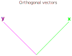
*Şekil 11: Ortogonal vektörler*

```python
x = np.array([[2], [0]])
y = np.array([[0], [2]])

cos_theta = (x.T @ y) / (np.linalg.norm(x,2) * np.linalg.norm(y,2))
print(f'açının kosinüsü = {cos_theta}')
# [[0.]] - ortogonal!
```

Bu vektörlerin **ortogonal** olduğunu görüyoruz çünkü $\cos \theta=0$. Bu $\approx 1.57$ radyana ve $\theta = 90^{\circ}$'ye eşittir.

### Doğrusal Denklem Sistemleri

Doğrusal cebirin bir araç olarak amacı **doğrusal denklem sistemlerini çözmektir**. Gayri resmi olarak, bu bir sonuç elde etmek için doğrusal segmentlerin doğru kombinasyonunu bulmak anlamına gelir.

Örneğin:
$$x + 2y = 8 \\
5x - 3y = 1$$

Bu, $x$ ve $y$ olmak üzere iki bilinmeyenli bir sistemdir. Geometrik olarak, her iki denklem de 2 boyutlu düzlemde düz bir çizgi üretir. Her iki çizginin kesiştiği nokta, doğrusal sistemin çözümüdür. (Cevap: $x=2$ ve $y=3$)

---

## Matrisler

Matrisler, makine öğrenmesinde vektörler kadar temeldir. Vektörlerle tek değişkenleri sayı kümeleri veya örnekler olarak temsil edebiliriz. Matrislerle, değişken kümelerini temsil edebiliriz. Bu anlamda, bir matris basitçe sıralı bir **vektör koleksiyonudur**.

Daha resmi olarak, bir matrisi $\textit{A}$ gibi italik büyük harfle gösteririz. İki boyutta, $\textit{A}$ matrisinin $m$ satır ve $n$ sütun olduğunu söyleriz.

### Temel Matris İşlemleri

#### Matris-Matris Toplama

Matrisleri eleman bazında ekleriz:

$$\textit{A} + \textit{B} := 
\begin{bmatrix}
a_{11} + b_{11} & \cdots & a_{1n} + b_{1n} \\
\vdots & \ddots & \vdots \\
a_{m1} + b_{m1} & \cdots & a_{mn} + b_{mn}
\end{bmatrix}
\in \mathbb{R^{m\times n}}$$

**NumPy'de**:

```python
A = np.array([[0,2],
              [1,4]])
B = np.array([[3,1],
              [-3,2]])

A + B
# array([[ 3,  3],
#        [-2,  6]])
```

#### Matris-Skaler Çarpma

```python
alpha = 2
A = np.array([[1,2],
              [3,4]])

alpha * A
# array([[2, 4],
#        [6, 8]])
```

#### Matris-Vektör Çarpma

```python
A = np.array([[0,2],
              [1,4]])
x = np.array([[1],
              [2]])

A @ x
# array([[4],
#        [9]])
```

#### Matris-Matris Çarpma

```python
A = np.array([[0,2],
              [1,4]])
B = np.array([[1,3],
              [2,1]])

A @ B
# array([[4, 2],
#        [9, 7]])
```

### Özel Matrisler

| Matris Türü | Tanım |
|-------------|-------|
| Dikdörtgen Matris | Satır sayısı ≠ Sütun sayısı |
| Kare Matris | Satır sayısı = Sütun sayısı |
| Köşegen Matris | Köşegen dışı elemanları sıfır olan kare matris |
| Üst Üçgensel Matris | Ana köşegenin altındaki elemanları sıfır olan matris |
| Alt Üçgensel Matris | Ana köşegenin üstündeki elemanları sıfır olan matris |
| Simetrik Matris | $\textit{A} = \textit{A}^T$ olan matris |
| Birim Matris | Ana köşegeni 1 olan köşegen matris ($\textit{I}_n$) |
| Skaler Matris | Ana köşegen elemanları eşit olan köşegen matris |
| Sıfır Matris | Tüm elemanları sıfır olan matris |

### Doğrusal Denklem Sistemleri Olarak Matrisler

Matrisler, doğrusal denklem sistemlerini temsil etmek için idealdir. Geometrik olarak, bu temsilin çözümü, her denklem için 3 boyutlu uzayda bir **düzlem kümesi** çizmeye ve düzlemlerin kesiştiği segmenti bulmaya eşittir.

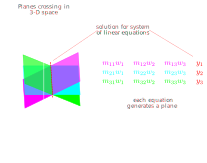
*Şekil 12: Denklem sisteminin düzlemler olarak görselleştirilmesi*

Alternatif olarak, sistemi **sütun vektörlerinin doğrusal kombinasyonu** olarak temsil etmeyi tercih edebiliriz:

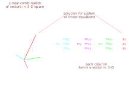
*Şekil 13: Denklem sisteminin sütun vektörlerinin doğrusal kombinasyonu olarak gösterimi*

### Matris Tersi

**Ters matris**, başka bir matrisi *sağdan veya soldan* çarptığında birim matrisini döndüren matristir:

$$\textit{A}^{-1}\textit{A} = \textit{I}_n = \textit{A}\textit{A}^{-1}$$

```python
A = np.array([[1, 2, 1],
              [4, 4, 5],
              [6, 7, 7]])

A_i = np.linalg.inv(A)
print(A_i)
```

---

## Doğrusal Dönüşümler

### Doğrusal Dönüşümler

Doğrusal dönüşüm, doğrusal cebirin temel kavramlarından biridir. Bir matris, bir vektör uzayından diğerine bir dönüşümü temsil edebilir.

### Afin Dönüşümler

Afin dönüşümler, doğrusal dönüşümlerin bir çevirme (translation) eklenmiş halidir.

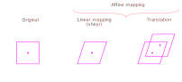
*Şekil: Afin dönüşüm*

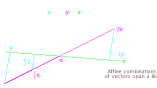
*Şekil: Afin kombinasyon*

### Özel Doğrusal Dönüşümler

| Dönüşüm | Etkisi | Matris |
|---------|--------|--------|
| Ölçekleme | Vektörün boyutunu değiştirme | $\begin{bmatrix} s_x & 0 \\ 0 & s_y \end{bmatrix}$ |
| Yansıma | Aynalama | $\begin{bmatrix} -1 & 0 \\ 0 & 1 \end{bmatrix}$ |
| Kayma (Shear) | Vektörü bir yönde kaydırma | $\begin{bmatrix} 1 & k \\ 0 & 1 \end{bmatrix}$ |
| Döndürme | Vektörü bir açıyla döndürme | $\begin{bmatrix} \cos\theta & -\sin\theta \\ \sin\theta & \cos\theta \end{bmatrix}$ |

### Projeksiyonlar

Projeksiyonlar, bir vektörü bir alt uzaya "iz düşürme" işlemidir. En yaygın kullanımı, bir çizgiye veya düzleme en yakın noktayı bulmaktır.

---

## Matris Ayrıştırmaları

Matris ayrıştırma, bir matrisi daha basit matrislerin çarpımı olarak ifade etme işlemidir.

### LU Ayrıştırması

LU ayrıştırması, bir matrisi bir alt üçgensel matris (L) ve bir üst üçgensel matris (U) çarpımı olarak ifade etme yöntemidir:

$$A = LU$$

### QR Ayrıştırması

QR ayrıştırması, bir matrisi bir ortogonal matris (Q) ve bir üst üçgensel matris (R) çarpımı olarak ifade eder:

$$A = QR$$

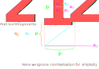
*Şekil: Gram-Schmidt Orthogonalization - QR ayrıştırması için kullanılan yöntem*

### Determinant

Determinant, bir matrisin "ölçeğini" veya "hacmini" ölçen bir sayıdır. Kare matrisler için tanımlıdır.

$$\det(A) \text{ veya } |A|$$

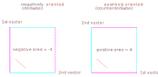
*Şekil: Determinant yönelimi - Alan işaretleme*

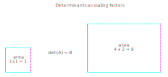
*Şekil: Determinant ölçekleme - Hacim değişimi*

### Özdeğerler ve Özvektörler

Bir matrisin **özdeğerleri** ve **özvektörleri**, matrisin dönüşüm özelliklerini anlamak için kritik öneme sahiptir.

$$\textit{A}\bf{x} = \lambda\bf{x}$$

Burada:
- $\lambda$: Özdeğer (skaler)
- $\bf{x}$: Özvektör (sıfır olmayan vektör)

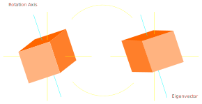
*Şekil: Özvektör - Dönüşüm altında yön değiştirmeyen vektör*

#### Özayrıştırma (Eigendecomposition)

$$A = V\Lambda V^{-1}$$

Burada:
- $V$: Özvektörlerden oluşan matris
- $\Lambda$: Köşegeninde özdeğerler olan köşegen matris

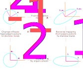
*Şekil: Özayrıştırma - Bir matrisin özvektör ve özdeğerlerine ayrıştırılması*

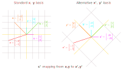
*Şekil: Temel değişimi - Farklı koordinat sistemleri arası dönüşüm*

### Tekil Değer Ayrıştırması (SVD)

Tekil Değer Ayrıştırması (Singular Value Compression - SVD), muhtemelen doğrusal cebirin en önemli ve güçlü aracıdır. Bir matrisi üç matrisin çarpımı olarak ifade eder:

$$\textit{A} = \textit{U}\Sigma\textit{V}^T$$

Burada:
- $\textit{U}$: Sol tekil vektörler ($m \times m$ ortogonal matris)
- $\Sigma$: Tekil değerler ($m \times n$ köşegen matris)
- $\textit{V}^T$: Sağ tekil vektörler ($n \times n$ ortogonal matrisin devriği)

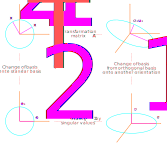
*Şekil: Tekil Değer Ayrıştırması (SVD) - Geometrik yorum*

#### Düşük Ranklı Yaklaşım

SVD, bir matrisin en iyi düşük ranklı yaklaşımını bulmak için kullanılır:

$$A_k = U_k \Sigma_k V_k^T$$

Bu, gürültü azaltma, boyut indirgeme ve veri sıkıştırma için kullanılır.

---

## Python ile Örnekler

### NumPy Kütüphanesi

```python
import numpy as np

# Vektör oluşturma
x = np.array([1, 2, 3])
y = np.array([4, 5, 6])

# Vektör toplama
z = x + y

# Nokta çarpımı
dot_product = np.dot(x, y)
# veya
dot_product = x @ y

# Matris oluşturma
A = np.array([[1, 2], [3, 4], [5, 6]])

# Matris transpozu
A_T = A.T

# Matris çarpımı
B = np.array([[1, 2], [3, 4]])
C = np.array([[5, 6], [7, 8]])
D = B @ C

# Matris tersi
B_inv = np.linalg.inv(B)

# Özdeğerler ve özvektörler
eigenvalues, eigenvectors = np.linalg.eig(B)

# SVD
U, S, Vt = np.linalg.svd(A, full_matrices=False)

# Norm hesaplama
L2_norm = np.linalg.norm(x, 2)
L1_norm = np.linalg.norm(x, 1)

# Determinant
det = np.linalg.det(B)

# Rank
rank = np.linalg.matrix_rank(A)
```

---

## Kaynakça ve İleri Okuma

### Türkçe Kaynaklar
- **Lineer Cebir** - Gilbert Strang (Türkçe çevirisi)
- **Matematikte Yeni Bir Başlangıç** - Say Yayınları

### İngilizce Kaynaklar
1. **Mathematics for Machine Learning** - Deisenroth, Faisal, Ong
2. **Introduction to Applied Linear Algebra** - Boyd & Vandenberghe
3. **Deep Learning** - Goodfellow, Bengio, Courville (Lineer Cebir bölümü)
4. **Introduction to Linear Algebra** - Gilbert Strang (5. Baskı)
5. **No Bullshit Guide to Linear Algebra** - Ivan Savov

### Video Dersler
- 3Blue1Brown - Essence of Linear Algebra (YouTube)
- MIT 18.06 - Linear Algebra (Prof. Gilbert Strang)
- Khan Academy - Linear Algebra

---

**Not:** Bu belge orijinal kaynağın çevirisidir. Matematiksel terimlerin Türkçe karşılıkları literatürde yaygın olarak kullanılan şekillerde seçilmiştir.

**İletişim:**  
Orijinal yazar: pcaceres@wisc.edu ve https://pablocaceres.org/  
Orijinal Kaynak: https://pabloinsente.github.io/intro-linear-algebra

---

*Son Güncelleme: 2026*
